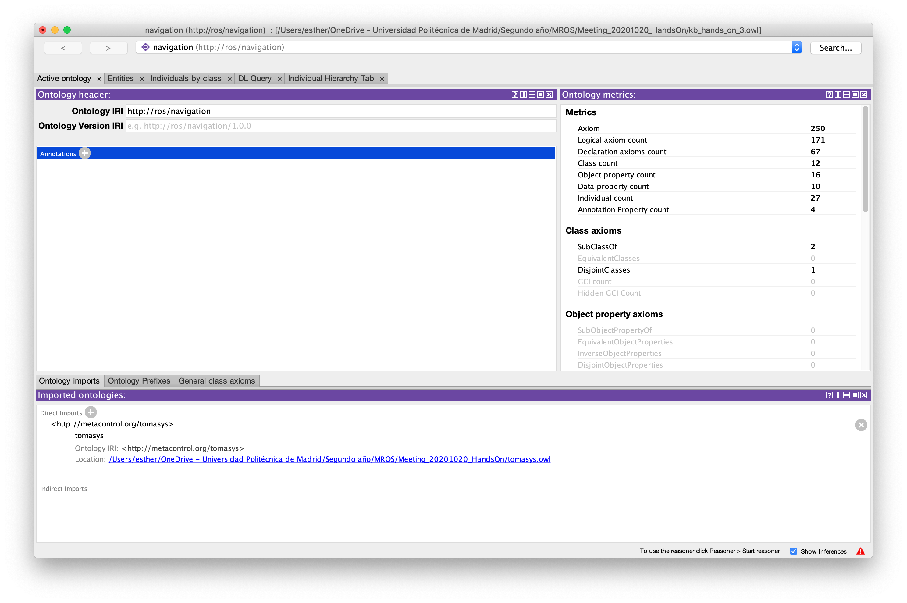
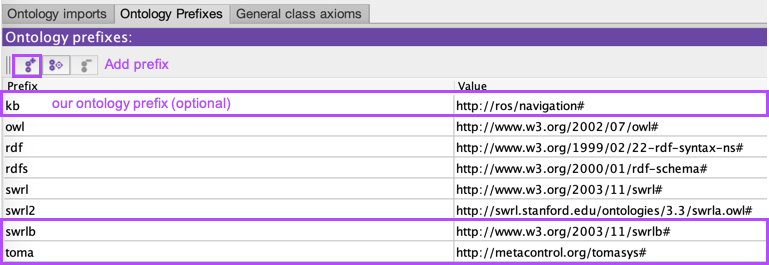
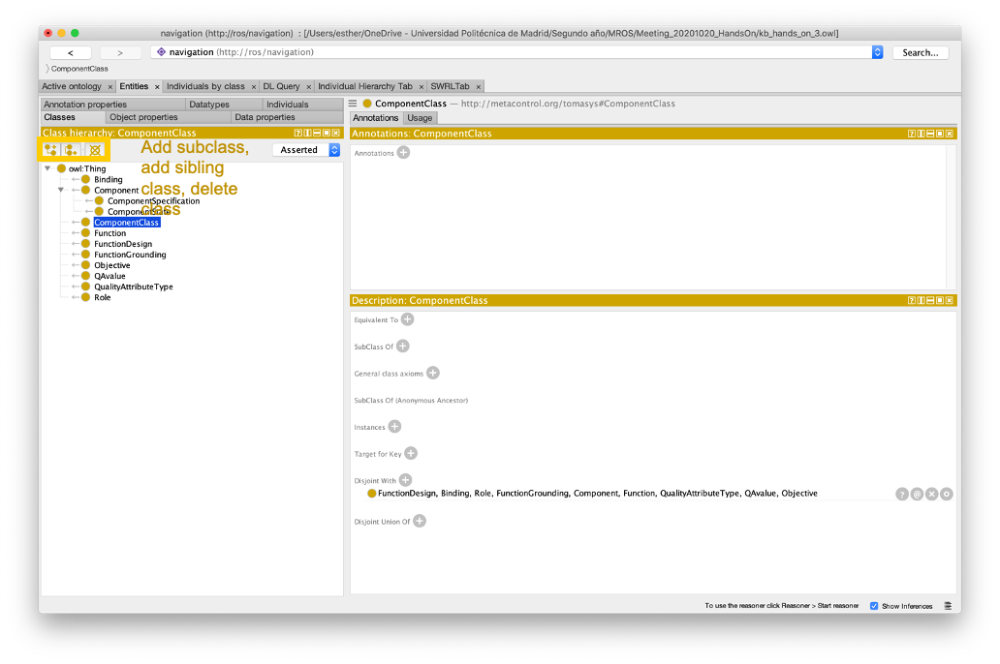
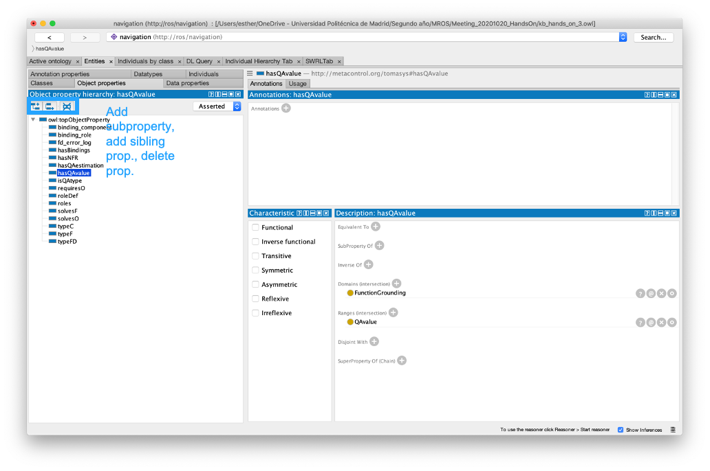
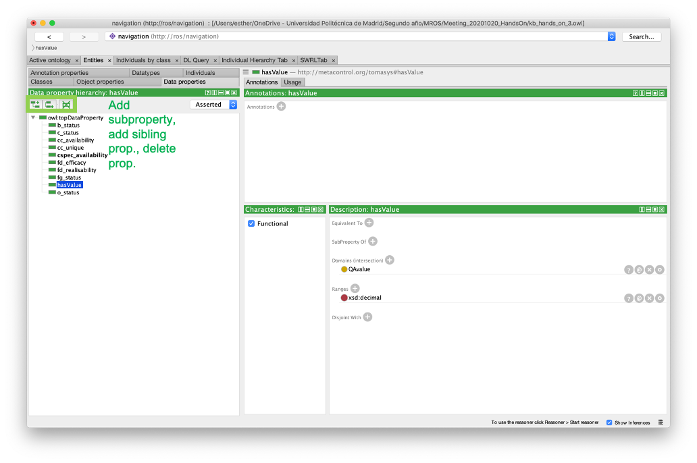
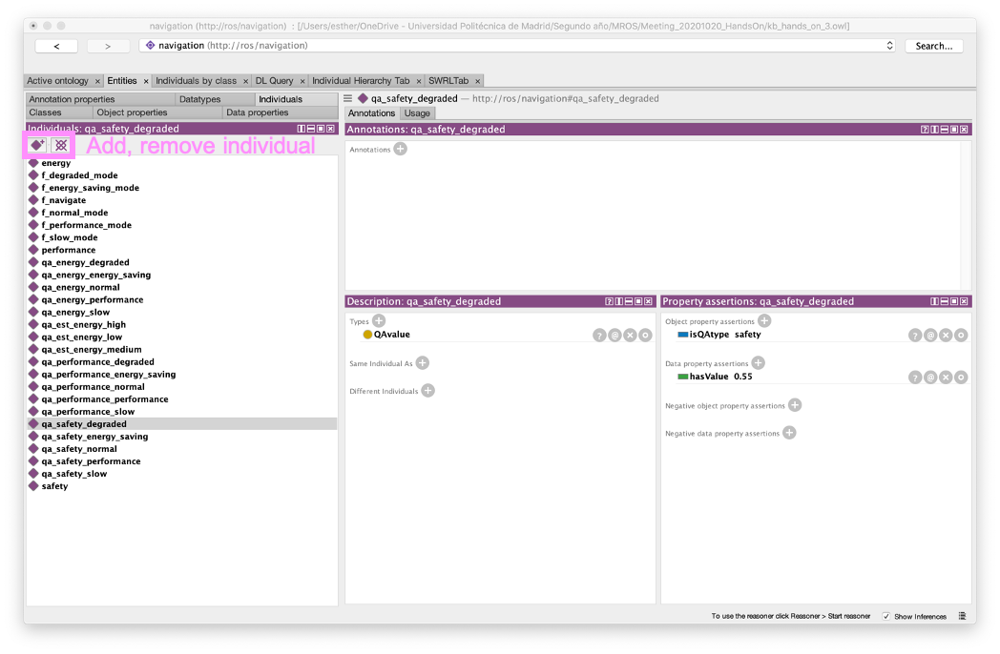
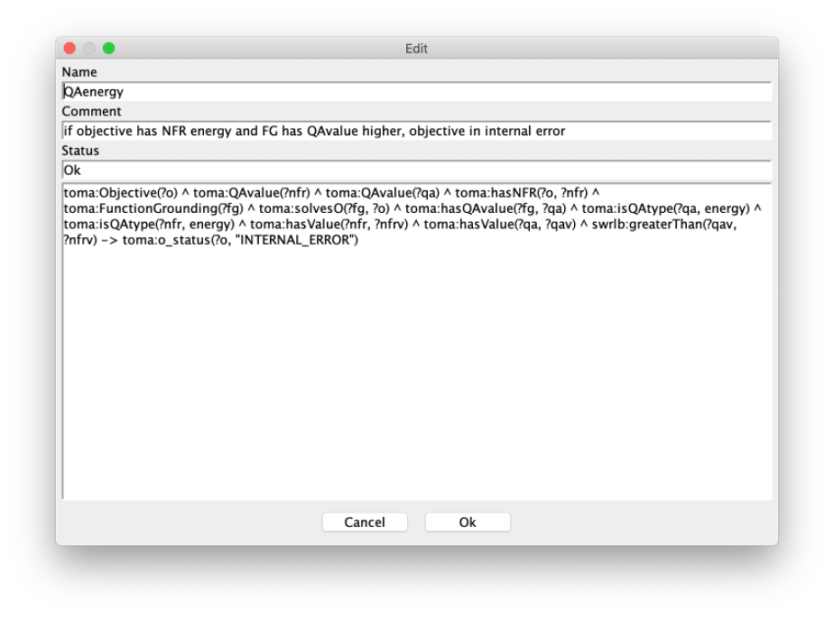
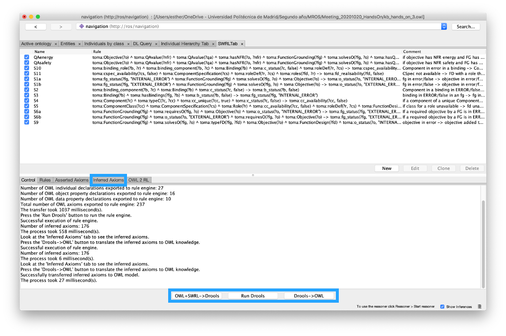

# Ontology-Hands-On
A tutorial on how to create ontologies from scratch.

## Table of Contents
1. [Installing Protégé](#installing-protege)
2. [Creating an ontology](#creating-an-ontology)
3. [Making rules](#making-rules)
4. [Saving the ontology](#saving-the-ontology)
5. [Resources](#resources)

## Installing Protégé
An ontology is a specification of a conceptualization, so it can be written in any machine-readable text such as XML. However, we use Protégé 5.5.0 to provide an easy environment for ontology creation.
First, we need to install Protégé software, available [here](https://protege.stanford.edu/products.php#desktop-protege).

The first time Protégé opens ask us if we need to install any plugin. For rule definition we can use SWRL, so we install **SWRL Tab Plugin**. Additionally, to test the rules created we install  **Pellet Reasoner**.
Plugins can be installed anytime in File > Check for Plugins.

## Creating an ontology

Once we have set up the Protégé environment, we create a new ontology in File > New. Then we need to identify our ontology with Ontology IRI and Ontology Version IRI.
For instance, our hands-on ontology has this identification.

Ontology IRI: http://ros/navigation

As ontologies are used for knowledge reusing, we can import some ontologies. We can import them by URL or selecting the local archive in our file system.
To do so we need to click the plus symbol in Direct Imports in the Imported ontologies section.

Afterward, we need to check ontology prefixes. On the Ontology Prefixes tab situated next to the Ontology Imports, we need to check if there is a prefix for the imported Ontologies. In this case, we need to search for the **Toma** prefix of Tomasys ontology. We should also check if the swrlb prefix exists because it will be used for rule creation. Additionally, we can set a prefix for our ontology created.
If we need to add any prefix, we have to press the first button and add the prefix name on the left and the IRI of the ontology on the right.

### Adding classes and properties

To start adding concepts, we need to situate on the Entities > Classes tab. Here we can add the classes and arrange them to form the taxonomy. Note that the relationship between a sub-class and a class is an **is-a** relationship,
e.g. Chess is a sub-class of the class Game. The first button is to add a subclass whereas the second bottom allows us to add a sibling class. The third one deletes the selected class. 

Once we have the taxonomy, we need to add properties. First, we create properties to link different classes, these are the **object properties**. Here we have, solve and type properties.
On the right panel, you need to select the domain and range of the property. The domain is the class subject of the property and the range, the object of the property,
e.g. Chess (sub-class of Game) has an isType relationship with GameType. Here, the domain of the isType relationship is Game and the range is GameTipe, so chess is a type of strategy game (a subclass of GameType).

Afterwards, we need to set **data properties**. Once they are added, we assign the domain and range. Here the domain is the class affected by the property and the range the type and values it can aquire.

### Adding individuals

Individuals are instances of classes. We need to specify the class to which it belongs. We also can have property assertions to other objects or data. Moreover, more property assertions will be made after rule-reasoning.
To create an individual we need to press the diamond button. Then we add the class in the plus button on the right description panel. The same goes for property assertion in the last panel. The reasoner uses these instances to extract knowledge from the specific elements the user has defined (individuals) and its relationships through classes and properties.

## Making rules

The first step is to habilitate the SWRL Tab by selecting Window > Tab > SWRL Tab.

We click on the new rule button. We can add a name and a short description. Here is an example of a rule.

As we can see we have quite a few statements linked by the ^ symbol. Each statement starts with a prefix, for instance, here we use toma as prefix from Tomasys Ontology and swrlb to generate statements of SWRL such as comparing two values with greaterThan statement.
Each statement uses variables to identify the element it is reasoning about. 

- toma:Objective(?o): the ? symbol means any, so here any individual from the class objective is influenced by this statement
- toma:isQAtype(?qa, energy): in this case, as isQAtype is an object property, the variables used are any quality attribute (domain of this property) but only the instance energy of the quality attribute type class (range of this property).

Every rule ends with a conclusion with an arrow symbol ->

This rule ends in a change of the value of data properties such as:
toma:o_status(?o, "INTERNAL_ERROR")

When we have created all rules, we can press the bottom at the end of the window to start reasoning. First, we convert the OWL and SWRL to the Drools rule engine, we evaluate the rules by clicking Run Drools and then we translate the Results to OWL. In the inferred axioms tab we can detect the knowledge derived from our ontology.

## Saving the ontology

When we press File > Save as... to save our ontology, Protégé ask us the format to save. A recommended format is RDF/XML Syntax as it is quite simple to read and can by opened by most text editors.

## Resources

[Ontology 101](https://protege.stanford.edu/publications/ontology_development/ontology101.pdf)

[Protégé Tutorial](http://mowl-power.cs.man.ac.uk/protegeowltutorial/resources/ProtegeOWLTutorialP4_v1_3.pdf)
